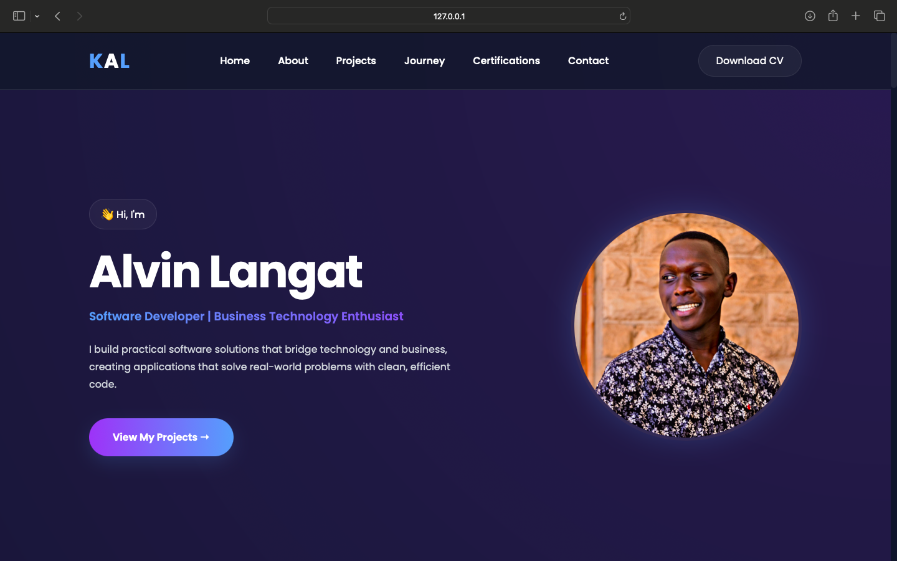

# 🌐 Alvin Kipng'eno Langat | Portfolio Website

A modern, responsive portfolio website showcasing my software development projects, professional experience, certifications, and technical skills.

Built with performance, accessibility, and clean design in mind, this portfolio serves as my professional online presence and will continue evolving as I grow my experience and projects.

---

## 📸 Preview



---

## 🚀 Live Website

**Visit:** https://YOUR-GITHUB-PAGES-URL

---

## ✨ Features

- Responsive design
- Modern and minimal interface
- Smooth scrolling navigation
- Scroll reveal animations
- Professional Journey
- Certifications
- Downloadable CV
- Contact section
- Custom 404 page
- SEO-friendly metadata

---

## 🛠 Technologies

- HTML5
- CSS3
- JavaScript (ES6)
- Font Awesome
- Git & GitHub

---

## 📂 Project Structure

```
PortfolioWebsite/
│
├── assets/
│   ├── css/
│   ├── js/
│   ├── images/
│   ├── icons/
│   ├── resume/
│   └── certificates/
│
├── index.html
├── 404.html
└── README.md
```

---

## 💻 Run Locally

```bash
git clone https://github.com/heisallaki/PortfolioWebsite.git
cd PortfolioWebsite
```

Open `index.html` in your browser, or run the project using VS Code Live Server.

---

## 🤝 Connect

**LinkedIn**  
https://www.linkedin.com/in/alvin-langat

**GitHub**  
https://github.com/heisallaki

**Email**  
alvinlangat.al@gmail.com

---

## 📄 License

This project is licensed under the MIT License.

---

## 👨‍💻 Author

**Alvin Kipng'eno Langat**

Software Developer | Business Technology Enthusiast